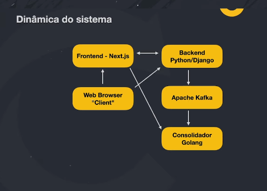

# cartola-fc 
# Full Cycle

[imersão 11 ](https://imersao.fullcycle.com.br/aula/mundo-full-cycle-e-estudo-de-caso-cartola/)
#
# Requisitos:
1. Desenvolver um clone do jogo 'Cartola FC'
2. O Cartola (operador do jogo) poderá escalar seu time baseado em uma lista de jogadores
3. Cada jogador terá um preço
4. O time começará com um valor em caixa que não possibilitará comprar qualquer jogador
5. Quando um jogo acontecer e se um dos jogadores escalados realizar uma ação, o valor desse jogador será alterado conforme a ação, bem como do time do cartola que escalou tal jogador
6. O Cartola poderá escalar seu time apenas quando não há jogos acontecendo
7. Objetivo principal é conseguir escalar os melhores jogadores paara ter o melhor time com maior dinheiro em caixa

# Dinâmica do sistema

# Tecnologias a serem utilizadas
* Frontend do jogo: Next.js
* Backend do jogo: Python/Django
* Área  administrativa: Python/Django
* Microsserviço de consolidação: Golang
* Apache Kafka
* Docker e Kubernetes

# sqlc - gerar migration go
1. sqlc generate

# go - comandos
1. go mod init [nome do pacote]
* go mod init github.com/antonioGabrielGomes/cartola-fc
2. go mod tidy